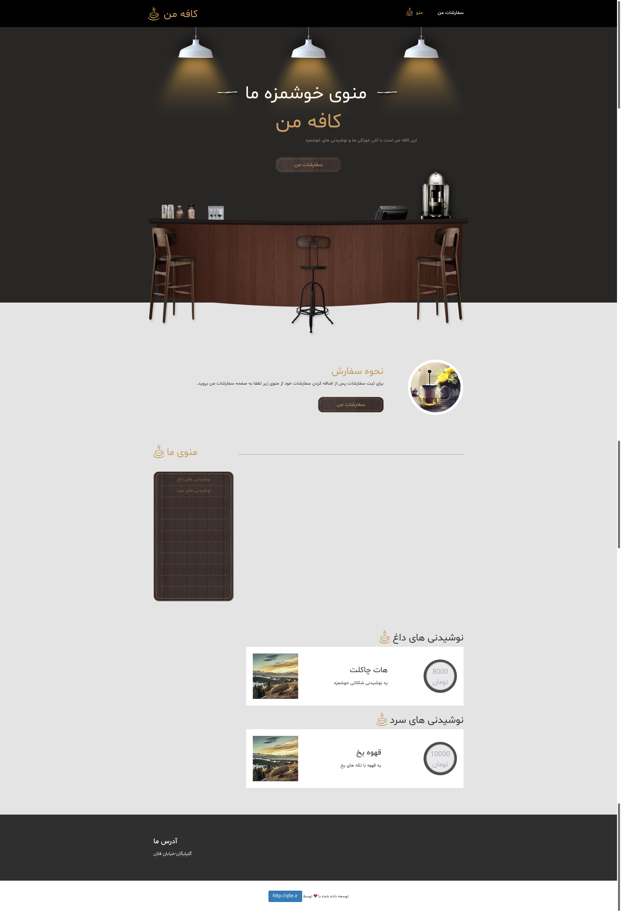
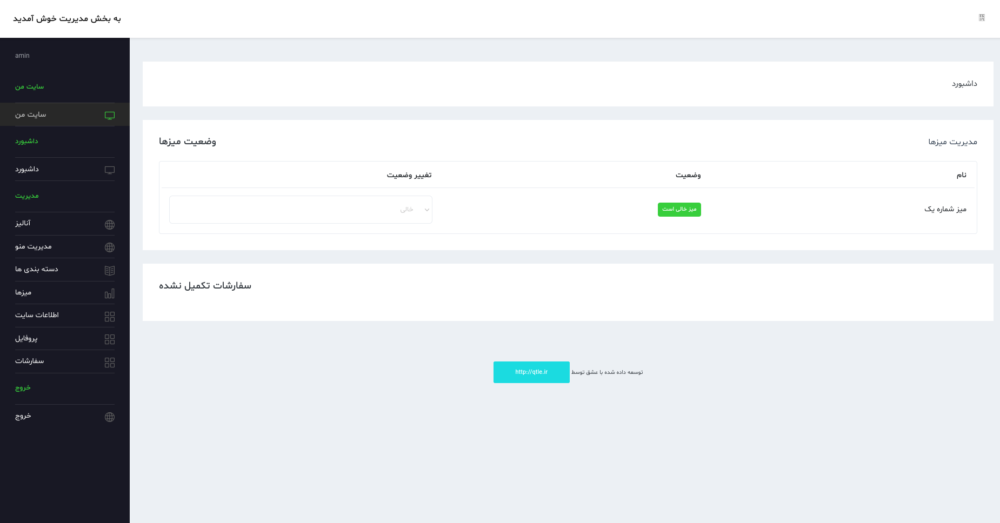
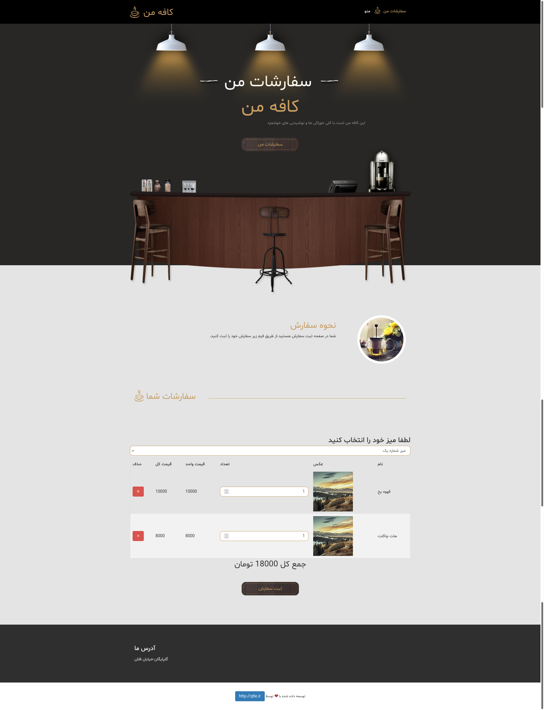
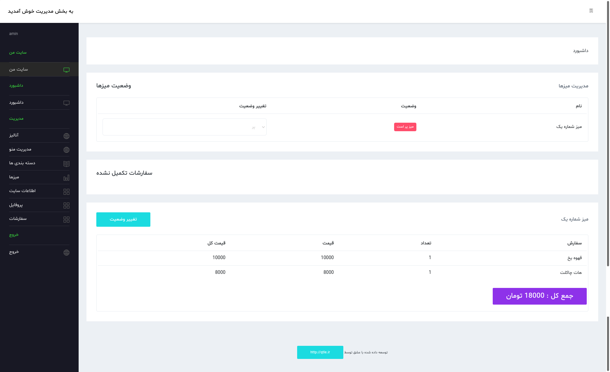
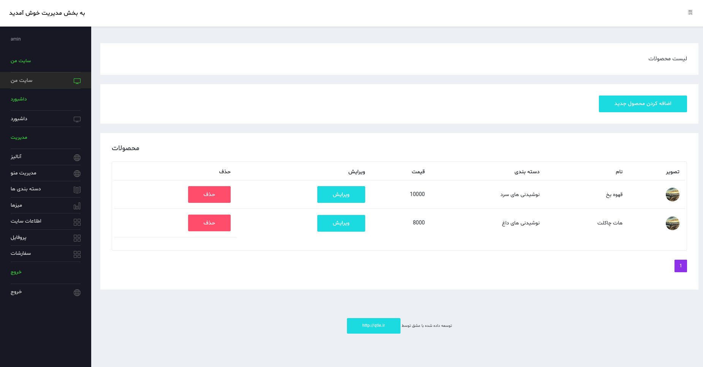
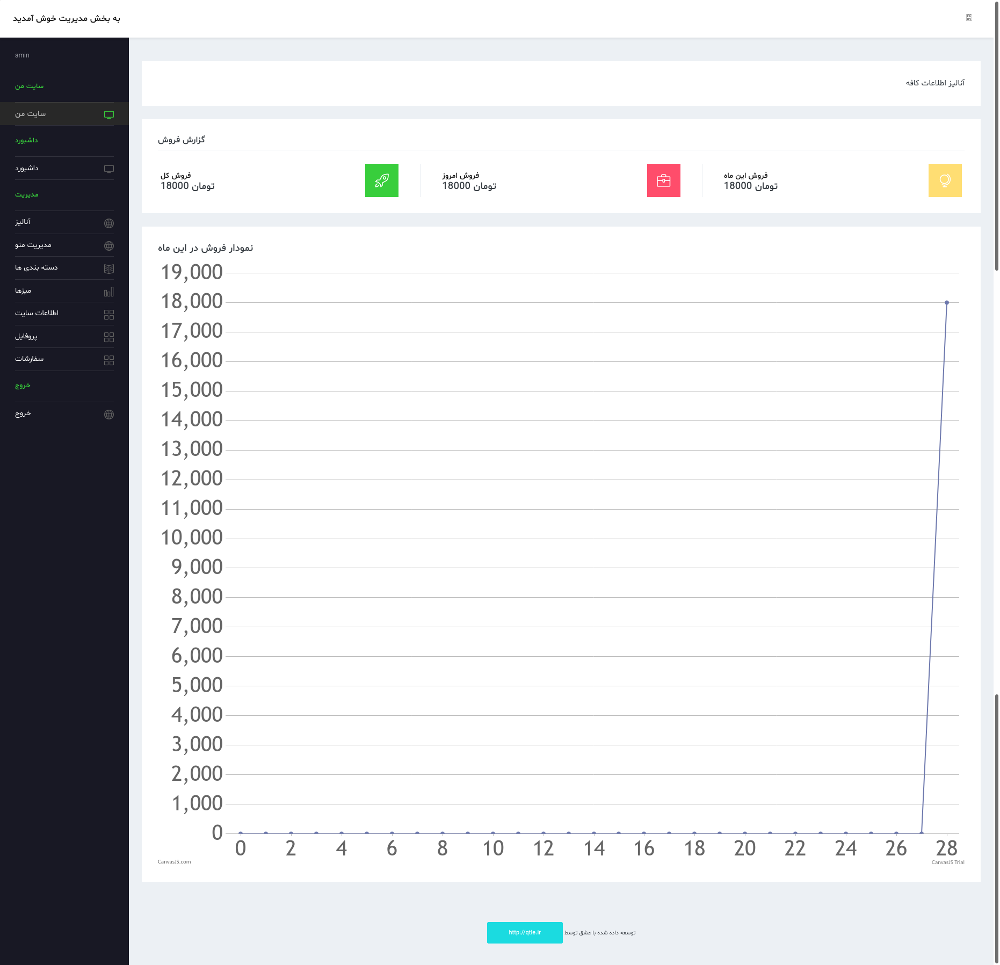

# Coffee website

Manage your desks. Manage your drinks and products. Manage your orders and deliver them to the customer.

This site should be set up locally. Customers turn on their Wi-Fi when they come to your cafe, and after connecting to your Wi-Fi, they are transferred to the site and register their order.

You see in the order management section and take the orders to the specific table of the customer.

The site database is mysql.
Site written by:
* PHP
* MYSQL
* HTML
* CSS
* Ajax

## installation:

Download the project files and put them in the root of your site. Create a database and set the connection information in the following two files.

```
includes/db.php
myadmin/includes.db.php
```

Insert the database.sql file in the database.

## Admin Area

You can go to admin area with this address.
```
http://<your-domain>/myadmin
```
And login with:
```
Email : admin@gmail.com
Pass : admin
```
You can change it later.

## Screenshots
### -- Home page


### -- Amin home page


### -- Orders page


### -- Admin home page with customer orders


### -- Products page


### -- Analyze admin page

